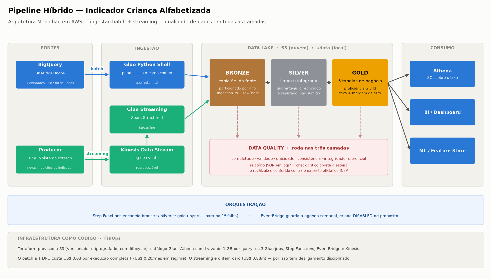
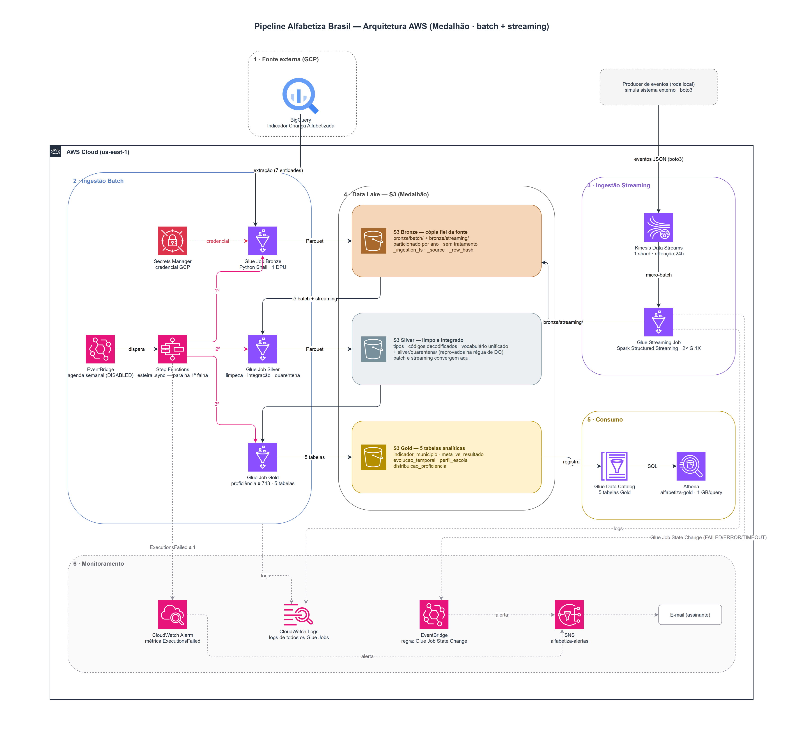

# Pipeline Híbrido para Análise da Alfabetização no Brasil

Tech Challenge — Fase 2, Pós Tech.

Este repositório constrói um pipeline de dados completo (batch + streaming, arquitetura Medalhão, rodando na AWS) em cima das bases do **Indicador Criança Alfabetizada**. O objetivo não é só mover dado de um lugar para outro: é chegar numa camada analítica em que dá para confiar no número — e saber exatamente onde ele não pode ser usado.

---

## Contexto do problema

O **Compromisso Nacional Criança Alfabetizada** é a política pública que estabelece que, até 2030, toda criança brasileira deve estar alfabetizada ao final do 2º ano do ensino fundamental.

Mas o que é "estar alfabetizada"? Sem um critério objetivo, a política não teria como ser medida nem cobrada. Em 2023 o INEP realizou a Pesquisa Alfabetiza Brasil e fixou um corte: **743 pontos na escala de proficiência do Saeb**. Quem atinge esse patamar é considerado alfabetizado, e o percentual de crianças acima do corte é o **Indicador Criança Alfabetizada**.

É esse indicador que este pipeline calcula, e é em cima dele que cada município tem uma meta pactuada, ano a ano, até 2030.

> **Traduzindo: o que é a escala Saeb?**
> Não é uma nota de 0 a 10, nem uma porcentagem de acertos. É uma escala própria, construída para comparar alunos que fizeram provas diferentes. Na avaliação do 2º ano, as notas da base vão de **578 a 904** — o corte de 743 fica no meio dela. Isso importa mais do que parece: quem tenta usar aqui os cortes de outras avaliações do Saeb (como o "nível crítico" de 500 pontos, que vem da prova do 5º e 9º ano) classifica **zero** crianças, porque nessa escala ninguém tira menos de 578.

O desafio de engenharia está em que essas informações vivem separadas: microdados por aluno de um lado, metas nacionais, estaduais e municipais de outro, resultados agregados publicados em terceiro. Nenhuma dessas bases sozinha responde "quantas crianças estão alfabetizadas, onde, e a que distância da meta". O pipeline existe para integrá-las.

### As fontes

Tudo vem da [Base dos Dados](https://basedosdados.org/dataset/073a39d4-89cf-4068-b1e8-34ed0d9c0b72?table=e1de7a6a-5038-4e81-89f0-a15f2cc12c9b), que publica o dataset no BigQuery (`basedosdados.br_inep_avaliacao_alfabetizacao`). São as 6 entidades pedidas no enunciado, mais o dicionário de códigos da própria fonte:

| Entidade | O que tem | Tamanho |
|---|---|---|
| `alunos` | microdados por aluno: proficiência, rede, escola, peso amostral | 3,87 mi de linhas |
| `municipio` | resultados oficiais por município — o **gabarito** do projeto | ~24 mil |
| `uf` | resultados oficiais por estado | 145 |
| `meta_alfabetizacao_brasil` | metas nacionais | 3 |
| `meta_alfabetizacao_uf` | metas por estado | 81 |
| `meta_alfabetizacao_municipio` | metas por município | ~10 mil |
| `dicionario` | de-para dos códigos (rede, presença, série) | 27 |

A tabela `municipio` merece destaque, porque ela muda o modo de trabalhar: como o INEP já publica a taxa oficial por município, dá para **recalcular o indicador do zero e conferir se bate**. Nenhuma decisão de cálculo neste projeto foi opinião — todas foram testadas contra esse gabarito.

---

## A arquitetura

### Diagrama da pipeline




### Fluxo de dados, passo a passo

1. **Extração.** O job da Bronze consulta as 7 entidades no BigQuery e grava cada uma em Parquet, sem nenhum filtro de negócio. A credencial do GCP vem do **Secrets Manager** (na nuvem) ou de um arquivo local (no desenvolvimento).
2. **Rastreabilidade.** Cada linha ganha três colunas: `_ingestion_ts` (quando entrou), `_source` (de onde veio) e `_row_hash` (impressão digital do conteúdo, para detectar mudança silenciosa na fonte).
3. **Limpeza e integração.** A Silver converte tipos, decodifica os códigos pelo dicionário da própria fonte, padroniza o vocabulário de rede (um rótulo só, do microdado até a meta), deriva a UF a partir do código IBGE do município e empilha as três tabelas de metas numa estrutura única.
4. **Quarentena.** Registro que reprova na régua (por exemplo, um município que não existe na dimensão) **não é descartado nem derruba a esteira**: vai para `silver/quarentena/` com o motivo anotado, para auditoria.
5. **Regra de negócio.** A Gold aplica `alfabetizado = proficiencia >= 743`, calcula as taxas e materializa as cinco tabelas analíticas.
6. **Consumo.** As tabelas Gold ficam registradas no catálogo do Glue e são consultadas via **Athena** em SQL puro.

Em paralelo, o **streaming** simula um sistema externo mandando novas medições: o producer publica eventos no **Kinesis**, um **Glue Streaming job** (Spark Structured Streaming) consome e materializa na mesma Bronze, e a Silver junta esses eventos às bases batch — que é onde as duas metades da ingestão de fato se encontram.

### As três camadas

**🥉 Bronze — cópia fiel da fonte.** Sem filtro, sem regra de negócio, sem "limpeza". Se a fonte tem lixo, a Bronze tem lixo — e é isso mesmo: quando um número der estranho lá na frente, quero poder voltar aqui e provar se o problema nasceu na fonte ou numa transformação minha. A tabela `alunos` é particionada por ano, então quem consulta 2024 não paga para ler 2023.

**🥈 Silver — limpo e integrado.** É onde as bases heterogêneas viram um conjunto coerente: tipos, códigos decodificados, vocabulário unificado, chaves normalizadas, flags de ausência (`presente`, `sem_nota`) e a quarentena. A suíte formal de qualidade roda aqui.

**🥇 Gold — as respostas.** Cinco tabelas, com esquema rígido documentado em [`docs/dicionario_dados_gold.md`](docs/dicionario_dados_gold.md):

| Tabela | Grão | Responde |
|---|---|---|
| `indicador_municipio` | ano × município | quantas crianças estão alfabetizadas, e onde |
| `meta_vs_resultado` | ano × nível × recorte | quem está longe da meta pactuada |
| `evolucao_temporal` | ano × recorte × rede | como o indicador se move no tempo |
| `perfil_escola` | ano × escola | quais escolas superam (ou ficam abaixo) do próprio contexto |
| `distribuicao_proficiencia` | ano × recorte × rede | onde as crianças estão na escala, não só se passaram do corte |

**Toda taxa vem acompanhada da própria margem de erro** (`ic95`). Isso não é preciosismo estatístico: em **45% dos municípios com meta pactuada**, a diferença entre o resultado e a meta é menor que a incerteza do próprio indicador. Sem essa coluna, a Gold estava publicando ruído com cara de fato.

---

## O que o pipeline descobriu

Um pipeline que só move dado não prova nada. Depois que a Bronze preservou a fonte, a Silver limpou e integrou as bases e a Gold aplicou a regra dos 743 pontos, deu para fazer as perguntas que motivaram o projeto — e algumas respostas surpreenderam. São cinco achados, todos reproduzíveis em [`notebooks/laboratorio_gold.ipynb`](notebooks/laboratorio_gold.ipynb), que registra o caminho inteiro, inclusive as ideias que não sobreviveram ao teste.

**1. O problema não está "no município" — está dentro da escola.**
A pergunta era: quando duas crianças têm proficiências muito diferentes, *onde* nasce essa diferença? Separando a variação total em três fatias, o resultado foi: só **16%** da diferença está entre municípios, **9%** entre escolas do mesmo município e **75% entre alunos da mesma escola**. Ou seja: duas crianças sentadas na mesma sala tendem a estar mais distantes uma da outra do que as médias de dois municípios diferentes. Isso incomoda porque o município é justamente o grão em que a política funciona — é ele que pactua meta, aparece em ranking e recebe repasse —, mas ele explica só um sexto do problema. Foi esse número que motivou a criação da tabela `perfil_escola`: se a ação precisa descer ao nível da escola, a camada analítica precisa enxergar a escola.

**2. O mapa das piores taxas não é o mapa das crianças.**
Existem duas formas de perguntar "onde está o problema?", e elas dão respostas opostas. Se a pergunta é *"quais municípios têm a pior taxa?"*, a resposta aponta para municípios pequenos, com poucas dezenas de alunos. Se a pergunta é *"onde estão as crianças não alfabetizadas?"*, a resposta aponta para as capitais e cidades grandes: metade de todas as crianças fora da alfabetização está concentrada em apenas **195 municípios** — 3,5% do total. E o mais revelador: comparando "os 50 municípios com pior taxa" com "os 50 com mais crianças fora", a sobreposição é **zero**. Nenhum município aparece nas duas listas. A lição: percentual esconde volume. Uma política que priorize só por taxa vai gastar esforço onde há poucas crianças; uma que olhe volume vai para onde elas de fato estão.

**3. Município pequeno não tem taxa ruim — tem taxa incerta.**
O indicador vem de uma pesquisa amostral, e amostra pequena produz número instável. **544 municípios** têm menos de 30 alunos avaliados, e nesses casos a margem de erro média é de **±17,6 pontos percentuais** — o suficiente para o mesmo município aparecer entre os melhores ou entre os piores do país só por sorte de sorteio. É por isso que toda taxa na Gold carrega a própria margem de erro (`ic95`): qualquer ranking montado sem olhar o tamanho da amostra enche o topo e o fundo da lista com ruído estatístico, não com realidade.

**4. A régua dos 9 níveis do INEP estava escondida — e foi possível reconstruí-la.**
A fonte publica quantos alunos caem em cada um dos 9 níveis de proficiência (`proporcao_aluno_nivel_0..8`), mas o dicionário **não diz onde um nível termina e o outro começa**. Sem os pontos de corte, essas colunas são inutilizáveis. Como o pipeline tem os microdados por aluno *e* as proporções oficiais por município, deu para trabalhar de trás para frente: derivar os cortes por quantis ponderados e conferir, município a município, se as proporções recalculadas batiam com as publicadas. Bateram — a régua é uma grade de 25 em 25 pontos a partir de 650, com erro mediano de **0,003pp** em 5.516 municípios. A descoberta virou tabela na Gold e virou check permanente de qualidade: se o INEP revisar os números, o pipeline acusa.

**5. Existe um contingente enorme logo abaixo da linha de corte.**
A taxa nacional trata igual a criança que ficou a 5 pontos do corte e a que ficou a 100 — mas para quem desenha intervenção, essa diferença é tudo. Medindo quantas crianças estão *quase lá*: se todas as que ficaram a até 10 pontos da linha a cruzassem, a taxa nacional saltaria de 59,2% para **67,0%** — quase 8 pontos percentuais em crianças que já estão na porta. É o argumento mais direto que a base oferece sobre onde o esforço rende mais rápido, e é o que a coluna `pct_quase_la` da Gold mede para cada recorte.

---

## Tecnologias, e por que cada uma

| Tecnologia | Onde | Por quê |
|---|---|---|
| **Python + pandas** | Bronze, Silver e Gold (batch) | o volume cabe em memória com folga (284 MB, 3,87 mi de linhas); Spark aqui só adicionaria JVM, shuffle e latência |
| **google-cloud-bigquery** | extração | lê direto da fonte, sem download manual de arquivo |
| **Parquet** | todas as camadas | colunar, comprimido, tipagem forte, e lido por Spark, Athena, DuckDB ou o que vier |
| **PySpark (Structured Streaming)** | Glue Streaming job | aqui o Spark não é enfeite: resolve micro-batch, schema, checkpoint e tolerância a falha |
| **AWS S3** | data lake | storage barato, versionado, com lifecycle |
| **AWS Glue** | execução | Python Shell no batch (pandas puro), Streaming no Kinesis |
| **Step Functions + EventBridge** | orquestração | encadeia as camadas e guarda a agenda |
| **Kinesis Data Streams** | fila de eventos | log de eventos de verdade, reprocessável |
| **Athena** | consumo | SQL sobre o lake, serverless, sem cluster ligado |
| **Secrets Manager** | credencial do GCP | na nuvem não existe arquivo de chave |
| **Terraform** | infraestrutura | toda a infra é código versionado, nada criado no console |

---

## Decisões arquiteturais

**Batch, streaming, ou os dois?** Os dois, porque resolvem problemas diferentes. As cargas históricas do INEP — microdados, metas, municípios — são grandes e mudam poucas vezes por ano: batch é o natural, processa o lote inteiro de uma vez. Já novas medições e revisões de meta são onde compensa reagir rápido, e é aí que entra o streaming. Mantive os dois separados desde a Bronze (`bronze/batch/` e `bronze/streaming/`) para poder reprocessar um lado sem encostar no outro. Só batch perderia o quase-tempo-real que o problema pede; só streaming pagaria complexidade à toa em cargas que são naturalmente periódicas.

**Data lake ou data warehouse?** Considerei resolver tudo num warehouse (Redshift, ou o próprio BigQuery que já é a fonte) e escrever SQL. Fiquei com data lake em S3 por dois motivos: os microdados já são 3,87 milhões de linhas e crescem a cada onda da pesquisa — storage barato em Parquet pesa mais que a conveniência do SQL —, e o formato colunar aberto não me prende a fornecedor. O warehouse não sai de cena, só troca de lado: as tabelas Gold ficam expostas via **Athena**, que dá a experiência de warehouse (SQL, catálogo, BI) sem manter cluster nenhum ligado. Na prática: lake para armazenar e refinar, warehouse serverless só na ponta do consumo.

**Custo ou performance?** Nesse volume dá para ter os dois, então otimizei custo sem sacrificar tempo de resposta perceptível. Parquet particionado faz a consulta ler só a fatia que interessa (menos byte escaneado = menos conta no Athena), a Bronze é materializada uma vez e todo o resto parte dela em vez de bater na fonte de novo, e nada fica ligado 24/7. Se a base crescer a ponto de a performance apertar, o caminho é subir um cluster Spark (Glue/EMR) sob demanda — pago mais em troca de paralelismo, mas como escolha consciente, não como padrão.

**pandas ou Spark?** Os dois, cada um no seu lugar. O Spark só começa a compensar lá pelas dezenas de GB; abaixo disso, o custo de subir cluster costuma deixar o job mais lento e mais caro que um pandas bem escrito. E cada nova onda da pesquisa soma ~3,9 mi de linhas por ano — levaria muito tempo até o volume pedir processamento distribuído. Por isso Bronze, Silver e Gold rodam em pandas (como Glue Python Shell job), e o Spark fica no streaming, onde a escolha não vem do volume e sim da natureza do problema. A regra que me guia: **trocar de ferramenta não pode mudar o resultado** — quando a migração vier, ela parte dos números que a versão em pandas já validou.

**Por que AWS, se a fonte está no BigQuery?** Usar GCP para tudo evitaria um hop de extração. Concentrei o lake na AWS pelo peso do ecossistema S3/Glue/Athena no mercado e por manter governança e custo num provedor só. O hop custa pouco: a extração roda uma vez por carga e cabe no free tier de 1 TB/mês do BigQuery.

**Desenvolver local, promover para a nuvem depois.** O `LAKE_PATH` aponta para `./data` no desenvolvimento e para `s3://<bucket>` na nuvem — o helper [`src/utils/lake.py`](src/utils/lake.py) resolve os dois. A estrutura de pastas local espelha exatamente o bucket. Ganho velocidade de iteração e não pago nuvem enquanto erro.

**Cadê a camada raw?** Algumas arquiteturas separam raw (formato original) de Bronze (Parquet + metadados). Como a fonte é um warehouse, não existe "arquivo original" a preservar — a Bronze já nasce sendo a cópia fiel. No streaming a história é outra: a pasta `landing/` guarda o JSON exatamente como chegou, fazendo o papel de raw.

**E o SQS, já que a nuvem é AWS?** Foi a pergunta que mais me fez pesquisar. Como *fonte* de dados o SQS não encaixa: é fila de tarefas, não log de eventos. A leitura é destrutiva (consumiu, some), então não dá para reprocessar histórico nem garantir ordem — que é justo o que o checkpoint do streaming pressupõe. Onde o SQS ajudaria é como *campainha* ("chegou arquivo novo no S3"), evitando varrer o bucket. No meu volume, listar é instantâneo, então não paga a complexidade. Para streaming de verdade, o caminho é Kinesis (o equivalente ao Kafka na AWS).


---

## Qualidade de dados

Os checks vivem em [`src/utils/data_quality.py`](src/utils/data_quality.py) e rodam **nas três camadas**, cobrindo o que o enunciado pede:

| Dimensão | O que verifica | Exemplo real |
|---|---|---|
| **Completude** | o dado está presente? | base não vazia; sem nulos em colunas-chave |
| **Validade** | formato e faixa corretos? | proficiência dentro da escala; código IBGE com 7 dígitos |
| **Unicidade** | sem duplicata indevida | `(ano, id_aluno)` é único; `(ano, id_escola)` é único |
| **Consistência** | os campos batem entre si? | aluno ausente não pode ter nota; todo `id_municipio` existe na dimensão |
| **Integridade referencial** | as chaves de relacionamento fecham? | município da Gold existe na Silver |

Cada check tem um de três desfechos: **pass**, **warning** (fica registrado, não derruba o pipeline) ou **fail** (aborta a execução — dado ruim não segue adiante em silêncio). Toda execução grava um relatório JSON em `logs/` com o score e o detalhe de cada verificação.

O check mais importante do projeto não é genérico: é o que **confronta o recálculo com o gabarito oficial** a cada execução. A taxa que a Gold calcula tem que reproduzir a que o INEP publica (mediana de 0,004pp de diferença), e os 9 níveis recalculados têm que reproduzir as colunas oficiais (mediana de 0,003pp). Se a fonte revisar um número, o check acusa.

**Por que não Great Expectations ou Soda?** Para o volume e o número de regras deste projeto, um módulo próprio de ~130 linhas cobre as mesmas dimensões sem adicionar dependência pesada — e me obrigou a entender cada validação em vez de configurar YAML. Num cenário com dezenas de fontes, migrar para uma dessas ferramentas seria o caminho natural.

---

## Testes

47 testes unitários em [`tests/`](tests/), cobrindo a lógica pura das quatro peças que carregam a regra de negócio e a qualidade de dados: `data_quality.py`, `lake.py`, `tratamento_integracao.py` e `metricas_gold.py`. Cada check de DQ, a regra dos 743 pontos, os cortes dos 9 níveis, a margem de erro ponderada, os quatro estados de `situacao_meta`, o resíduo de `perfil_escola` — tudo isso tem um teste que trava o número certo com uma massa de dado pequena e conferida à mão, não com a base inteira.

```powershell
pip install -r requirements.txt
pytest
```

Um deles é teste de regressão de verdade: reproduz o layout exato de arquivos que o Structured Streaming deixa no S3 quando ainda não chegou nenhum evento real (só `_spark_metadata`), e prova que a Silver não quebra mais nesse cenário — é o `KeyError: 'ano'` que derrubou o `alfabetiza-batch-silver` em produção antes da correção.

**Uma pegadinha do projeto, resolvida no `tests/conftest.py`:** os pacotes de camada (`01_bronze`, `02_silver`, `03_gold`) começam com dígito, que não é identificador Python válido — `from src.02_silver import x` é `SyntaxError`. Os testes importam via `importlib.import_module`, o mesmo truque que `scripts/glue_job_batch.py` já usa em produção para resolver isso.

**Fora do escopo, por decisão consciente:** a ingestão Bronze (`ingestao_batch_bigquery.py`) e os consumers de streaming em Spark (`ingestao_streaming_consumer.py`, `ingestao_streaming_kinesis.py`). Testar essas partes de verdade exigiria mockar o client do BigQuery ou subir uma SparkSession — o retorno por linha de teste cai muito, e o risco real do projeto está na lógica de transformação, não na chamada de API em si. Se um dia isso entrar em escopo, o caminho natural é separar a orquestração (I/O) da lógica (hoje já bem isolada em `ingest_table`/`ENTITIES`) e testar só a segunda.

---

## Monitoramento

O que existe hoje, e é o que sustenta a operação:

- **Log estruturado** em todos os scripts: início, fim, volume processado por entidade, e o caminho do relatório de DQ.
- **Relatórios de qualidade** persistidos (`logs/dq_<camada>_<timestamp>.json` local, `s3://<bucket>/logs/` na nuvem) — dão o histórico de score e o detalhe de cada check ao longo do tempo.
- **CloudWatch Logs** recebe automaticamente a saída dos Glue jobs (foi lendo esse log que descobri, por exemplo, que a Bronze havia gravado 3,9 mi de registros com sucesso).
- **Step Functions** encadeia as camadas com `.sync` e **para na primeira falha** — não existe Silver rodando sobre uma Bronze que quebrou.
- **Falha de ingestão é explícita**: `DataQualityError` aborta a execução, e o job aparece como `FAILED` no console do Glue.
- **Alarme com notificação por SNS** (`terraform/monitoramento.tf`): a esteira batch usa a métrica nativa do Step Functions (`ExecutionsFailed`) pra disparar um `aws_cloudwatch_metric_alarm`; o Glue Streaming, que roda fora da state machine, é pego por um evento nativo do Glue (`Glue Job State Change`) via EventBridge. As duas fontes mandam pro mesmo tópico SNS, com e-mail como assinante.

---

## FinOps

As decisões que reduzem custo, e o efeito de cada uma:

| Decisão | Efeito |
|---|---|
| **Parquet + compressão** em todas as camadas | menos storage, menos byte escaneado no Athena |
| **Particionamento por ano** | consulta de 2024 não lê 2023 |
| **pandas em vez de Spark no batch** | Glue Python Shell a 1 DPU, contra um cluster Spark mínimo de 2 DPU G.1X |
| **Bronze materializada uma vez** | a fonte não é re-consultada a cada experimento |
| **Nada ligado 24/7** | S3 e Athena são serverless; Glue cobra só enquanto roda |
| **Agenda EventBridge criada `DISABLED`** | agenda ativa em conta de lab = job rodando sem ninguém olhando o crédito |
| **Limite de scan no workgroup do Athena** (1 GB/query) | trava de custo: uma query mal escrita não escaneia o lake inteiro |
| **Lifecycle no S3** | `bronze/` migra para STANDARD_IA em 30 dias e Glacier em 90 |
| **`scripts/aws_desligar.ps1`** | destrói o Kinesis (cobra por shard-hora só de existir) ao fim da sessão |

### A conta, com números medidos

Preços de lista de `us-east-1`, aplicados aos tempos de execução reais dos jobs:

| Item | Cálculo | Custo |
|---|---|---|
| Glue batch (bronze 76s + silver 94s + gold 58s, 1 DPU) | 228s × 1 DPU × US$ 0,44/DPU-h | **US$ 0,03 por execução completa** |
| Mesma esteira, semanal | ~4,3 execuções/mês | **US$ 0,12/mês** |
| S3 (284 MB nas três camadas) | 0,28 GB × US$ 0,023/GB-mês | **US$ 0,01/mês** |
| Athena (Gold inteira = 3,6 MB) | US$ 5,00/TB escaneado | **< US$ 0,01** por query |

**Operação em regime: menos de US$ 0,20/mês.**

O custo real não está no batch — está no streaming, e por isso ele é o único item com disciplina de desligamento:

| Item | Custo |
|---|---|
| Glue Streaming (2 × G.1X) | **US$ 0,88/hora enquanto roda** |
| Kinesis (1 shard) | **US$ 0,015/hora só de existir**, mesmo parado |
| Uma demo de 30 min | **~US$ 0,45** |

Daí a regra: a demo é cronometrada e termina com `./scripts/aws_desligar.ps1`, que encerra as execuções, para os job runs e **destrói o stream** (o `aws_ligar.ps1` recria via `terraform apply`). O Glue Streaming job ainda tem `timeout` de 60 min como rede de segurança, caso alguém esqueça.

---

## Aplicação em IA

A Gold foi desenhada para servir modelo, não só dashboard — mas a parte mais útil desta seção é o que a **sondagem do dado provou que não dá para fazer**. Prometer feature que não existe é como um projeto de IA morre.

### O que dá para construir

**1. Predição de risco de não atingir a meta de 2030 (nível município).**
Alvo: `atingiu_meta` ou o `gap` de `meta_vs_resultado`. Features: o indicador defasado, a taxa de participação, o perfil de distribuição nos 9 níveis, o déficit absoluto, e — como enriquecimento externo — contexto socioeconômico do IBGE por `id_municipio` (PIB per capita, densidade demográfica, alfabetização adulta). O `id_municipio` é código IBGE de verdade, então esse join funciona.

**2. Clusters de vulnerabilidade educacional.**
A `distribuicao_proficiencia` dá o formato da curva de cada município, não só a média — dois municípios com a mesma taxa podem ter distribuições completamente diferentes, e é isso que separa "todo mundo perto do corte" de "uma metade bem e outra muito mal". É a base natural para agrupamento não supervisionado.

**3. Feature store no nível do aluno.**
Alvo: `proficiencia` (regressão) ou `alfabetizado` (classificação). Features: rede, contexto da escola e contexto do município. Aqui moram **dois vazamentos de alvo** que precisam ser tratados no desenho, não depois:

- *Vazamento pela escola.* A média da escola calculada com todos os alunos **inclui o próprio aluno** — o modelo lê o alvo pela porta dos fundos e o resultado vira ilusão. A correção é *leave-one-out*: `(soma_da_escola − nota_do_aluno) / (n − 1)`.
- *Vazamento pelo tempo.* O contexto municipal precisa vir do **ano anterior**. Como a base tem só duas ondas (2023 e 2024), isso significa que **só 2024 tem features defasadas** — o conjunto treinável de verdade é um ano só.

**4. Identificação de escolas que superam o contexto.**
A coluna `residuo` de `perfil_escola` já é, na prática, um modelo de valor agregado simplificado: compara a escola com o próprio município, controlando contexto socioeconômico e gestão. **2.085 escolas estão 20pp acima do próprio município.** Um modelo mais completo entraria por aqui.

### O que a base NÃO permite — e por quê

Isto vale tanto quanto a lista de cima, porque evita que a próxima pessoa gaste uma semana numa análise impossível:

| Ideia que parece óbvia | Por que não dá |
|---|---|
| Juntar com o **Censo Escolar** (urbano/rural, infraestrutura) | `id_escola` é **pseudônimo**, não o código INEP. Testei contra as 222.589 escolas do Censo: **interseção zero** |
| Acompanhar o **mesmo aluno** entre anos (modelo longitudinal) | `id_aluno` é sorteado de novo a cada ano. Dos que aparecem nos dois, só 0,1% caem na mesma escola. O join não dá erro — só mente |
| Comparar **escola pública × privada** | a rede privada não existe nesta base: 25 alunos em 2024, zero em 2023 |
| Feature de **evolução** ("quem mais melhorou") | regressão à média: a correlação entre a taxa de 2023 e o avanço é **−0,45**. Seria uma feature de "quem teve mais azar no ano anterior" |

### Política pública baseada em evidência

O que a camada analítica entrega para decisão, hoje:

- **Onde intervir por volume**, não por taxa — os 195 municípios que concentram metade das crianças fora da alfabetização (e que **não** aparecem no ranking das piores taxas).
- **Onde o esforço rende mais** — a coluna `pct_quase_la`: +7,8pp na taxa nacional se as crianças a 10 pontos do corte cruzassem a linha.
- **Onde a comparação é honesta** — a `situacao_meta` marca como `indistinguivel` os 45% de municípios em que o gap para a meta é menor que a margem de erro. Cobrar um prefeito por uma diferença que é ruído estatístico é injusto e caro.
- **Onde já existe solução funcionando** — as escolas com resíduo positivo alto, no mesmo contexto de vizinhas que vão mal.

---

## Estrutura do repositório

```
├── README.md
├── requirements.txt
├── .env.example                          # modelo de configuração (copiar para .env)
├── docs/
│   └── dicionario_dados_gold.md          # contrato das tabelas Gold: esquema + avisos de fonte
├── terraform/                            # toda a infra como código
│   ├── main.tf                           # S3 (versionado, criptografado, lifecycle), IAM
│   ├── glue_batch.tf                     # 3 Glue jobs + Step Functions + EventBridge
│   ├── glue_streaming.tf                 # Kinesis + Glue Streaming job
│   ├── athena.tf                         # catálogo Glue + workgroup com trava de custo
│   └── README.md                         # contexto do Learner Lab e decisões de infra
├── scripts/
│   ├── test_bigquery_connection.py       # smoke test da credencial
│   ├── glue_job_batch.py                 # wrapper que roda uma camada dentro do Glue
│   ├── deploy_glue_artifacts.ps1         # publica o código (src.zip) no S3
│   ├── aws_ligar.ps1 / aws_desligar.ps1  # controle de custo da sessão do lab
├── src/
│   ├── utils/
│   │   ├── lake.py                       # caminhos do lake: ./data local, s3:// na nuvem
│   │   ├── data_quality.py               # checks de qualidade reutilizáveis
│   │   ├── logger.py                     # logging padrão
│   │   └── spark_session.py              # sessão Spark (streaming)
│   ├── streaming/
│   │   └── producer_eventos.py           # simula sistema externo: --destino pasta | kinesis
│   ├── 01_bronze/
│   │   ├── ingestao_batch_bigquery.py    # BigQuery -> Bronze
│   │   ├── ingestao_streaming_kinesis.py # Kinesis -> Bronze (Glue Streaming, nuvem)
│   │   └── ingestao_streaming_consumer.py# pasta landing -> Bronze (variante local)
│   ├── 02_silver/
│   │   └── tratamento_integracao.py      # limpeza, padronização e integração
│   └── 03_gold/
│       └── metricas_gold.py              # regra dos 743 + as 5 tabelas analíticas
├── notebooks/
│   ├── exploracao_bronze.ipynb           # EDA da Bronze
│   ├── laboratorio_silver.ipynb          # prototipagem das transformações da Silver
│   └── laboratorio_gold.ipynb            # o laboratório: 4 atos, do cálculo aos achados
├── data/                                 # data lake local (gerado; fora do Git)
└── logs/                                 # relatórios de qualidade (gerados; fora do Git)
```

Se você está lendo o código pela primeira vez: comece por `scripts/test_bigquery_connection.py` (mostra como falamos com a fonte), depois `src/utils/`, e daí siga os números das pastas — `01_bronze` → `02_silver` → `03_gold` é a própria ordem de execução.

E se quiser entender **por que** o código é como é, o caminho é [`notebooks/laboratorio_gold.ipynb`](notebooks/laboratorio_gold.ipynb). Ele está versionado já executado (com os gráficos), dá para ler direto no GitHub.

---

## Como executar

### Pré-requisitos

- Python 3.11
- Um projeto no Google Cloud com a **BigQuery API** habilitada. O dataset é público, mas as consultas rodam por dentro do seu projeto — o free tier de 1 TB/mês cobre com folga
- Uma Service Account com papel `BigQuery User` e a chave JSON baixada

### Local

```powershell
git clone https://github.com/tuanyfortunato/pipeline-dados-alfabetiza-brasil.git
cd pipeline-dados-alfabetiza-brasil
python -m venv .venv
.venv\Scripts\Activate.ps1        # Linux/Mac: source .venv/bin/activate
pip install -r requirements.txt
```

Crie a pasta `credentials/`, coloque a chave JSON dentro, copie `.env.example` para `.env` e preencha:

```ini
GOOGLE_APPLICATION_CREDENTIALS=./credentials/sua-chave.json
GCP_PROJECT_ID=seu-project-id
LAKE_PATH=./data
```

`credentials/` e `.env` estão no `.gitignore` — nada disso sobe para o Git.

Depois é seguir a ordem das camadas:

```powershell
python scripts/test_bigquery_connection.py     # confere a credencial
python src/01_bronze/ingestao_batch_bigquery.py   # ~1 min; aceita entidades como argumento
python src/02_silver/tratamento_integracao.py
python src/03_gold/metricas_gold.py
```

Cada passo grava um relatório em `logs/dq_<camada>_<timestamp>.json`. Números da base atual:

| Camada | Resultado | Score de DQ |
|---|---|---|
| Bronze | 3,9 mi de registros, 7 entidades | — |
| Silver | 3,87 mi de alunos tratados, 410 linhas em quarentena | ~91% |
| Gold | 10,4 mil municípios · 79,3 mil escolas · 5 tabelas | ~94% (2 *warnings*) |

Os dois *warnings* da Gold são o mesmo grupo de municípios muito pequenos, e estão documentados no dicionário de dados. Uma prova de que o cálculo está certo: **a taxa Brasil 2024 recalculada dá 59,2 — exatamente o número oficial.**

### Na AWS

Toda a infra é provisionada por Terraform. O ambiente é um **Learner Lab da AWS Academy** (região fixa `us-east-1`, credencial temporária de ~4h, tudo assume a `LabRole`) — o contexto está em [`terraform/README.md`](terraform/README.md).

```powershell
cd terraform
terraform init
terraform apply                        # S3, Glue catálogo, Athena, jobs, Step Functions, Kinesis
cd ..
./scripts/deploy_glue_artifacts.ps1    # publica o código (src.zip) no S3
```
Ele lê a Silver e grava em `data/gold/` as cinco tabelas analíticas: `indicador_municipio/` (10,4 mil linhas), `meta_vs_resultado/` (gap, `ic95` e a `situacao_meta`), `evolucao_temporal/` (33,4 mil linhas, por recorte geográfico e rede), `perfil_escola/` (79,3 mil linhas - o grão que faltava) e `distribuicao_proficiencia/` (33,4 mil linhas, com os 9 níveis oficiais do INEP e as faixas de negócio). O relatório sai em `logs/dq_gold_<timestamp>.json` - na base atual, score de ~94% com dois *warnings*, ambos do mesmo grupo de municípios pequenos: o recálculo da taxa diverge do gabarito em 45 municípios (0,4%) e a distribuição por nível estoura a tolerância em 1,15% das células. Uma prova real: a taxa Brasil 2024 recalculada dá **59,2** - exatamente o número oficial.

Cada passo grava um relatório em `logs/dq_<camada>_<timestamp>.json`. Números da base atual:

| Camada | Resultado | Score de DQ |
|---|---|---|
| Bronze | 3,9 mi de registros, 7 entidades | — |
| Silver | 3,87 mi de alunos tratados, 410 linhas em quarentena | ~91% |
| Gold | 10,4 mil municípios · 79,3 mil escolas · 5 tabelas | ~94% (2 *warnings*) |

7. (Opcional) Os notebooks documentam o caminho até aqui: `notebooks/exploracao_bronze.ipynb` traz a EDA da Bronze (perfil das entidades, distribuição da proficiência, chaves), `notebooks/laboratorio_silver.ipynb` prototipa cada transformação da Silver com contagem antes/depois e `notebooks/laboratorio_gold.ipynb` valida as decisões de cálculo da Gold contra o gabarito oficial (ponderação pelo peso amostral, denominador, qual meta vale) e, na Parte 2, sonda as visões que deram origem às tabelas novas - incluindo a descoberta dos pontos de corte dos 9 níveis do INEP, que a fonte publica sem a régua. Todos estão versionados já executados, dá para ler direto no GitHub.

> ⚠️ **Custo:** o streaming é o único item caro (US$ 0,88/h + Kinesis por shard-hora). Rode a demo cronometrada e **encerre com `./scripts/aws_desligar.ps1`**.

O producer continua rodando local de propósito: ele *simula um sistema externo*, e sistema externo não roda dentro do pipeline — manda eventos para a borda (o Kinesis) via `boto3`.

**Consumo:** as cinco tabelas Gold estão registradas no catálogo do Glue e são consultadas em SQL no Athena, no workgroup `alfabetiza-gold` (com limite de 1 GB por query como trava de custo).

---

## Sobre o versionamento

O histórico do repositório acompanha a evolução do pipeline: uma **branch por frente** (`feature/silver`, `feature/gold`, `feature/streaming`, `feature/infra-aws`, `feature/cloud-batch`, `feature/cloud-streaming`, `feature/gold-visoes`), integradas por **Pull Request**, com a descrição justificando as escolhas. As mensagens de commit registram o *porquê* da mudança, não só o *o quê* — é lá que ficam as decisões que não cabem no código.

---

## Autora

**Tuany Fortunato do Carmo** — Tech Challenge Fase 2, Pós Tech.

Vídeo executivo: link será adicionado na entrega final.
